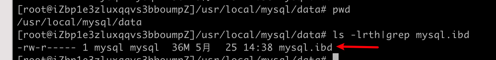

The data dictionary schema stores dictionary data in transactional (InnoDB) tables. Data dictionary tables are located in the mysql database together with non-data dictionary system tables.

数据字典模式在事务（innoDB）表中存储数据字典。数据字典表和非数据字典系统表一起位于 mysql 数据中

Data dictionary tables are created in a single InnoDB tablespace named mysql.ibd, which resides in the MySQL data directory. The mysql.ibd tablespace file must reside in the MySQL data directory and its name cannot be modified or used by another tablespace.

数据字典表创建在在一个名称为 mysql.ibd 的 innoDB 表空间中，位于 MySQL 数据目录中。mysql.ibd 表空间必须位于 MySQL 数据目录中，它的名称不能被其他表空间修改或者使用。

Dictionary data is protected by the same commit, rollback, and crash-recovery capabilities that protect user data that is stored in InnoDB tables.

字典数据被相同的提交、回滚、奔溃恢复功能保护，保护存储在 innoDB 表中的用户数据